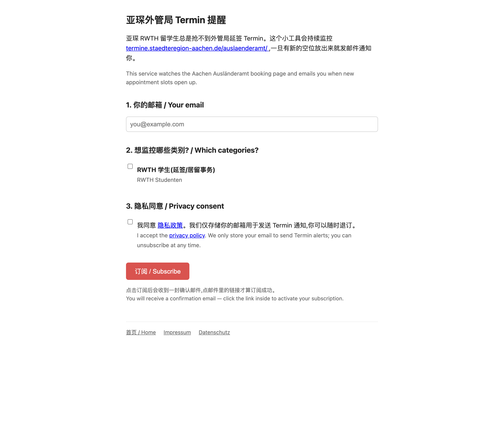

# Aachen Termin Tracker

<p align="center">
  <a href="https://aachen-termin.online">
    
  </a>
</p>

<p align="center">
  <a href="https://aachen-termin.online"></a>
  
  
  
</p>

> **亚琛外管局 Termin 抢号通知 · 免费 · 开源**
>
> 留学生抢不到 Außenstelle RWTH 延签号是亚琛留学生群里月经话题。
> 这个小工具每分钟去查一次,有新空位放出就立刻给你发邮件。
>
> 👉 **直接订阅:** [aachen-termin.online](https://aachen-termin.online)

---

## 这解决了什么问题

RWTH 国际学生在亚琛外管局(Außenstelle Super C)办延签、首次申请居留卡等业务都需要预约 Termin。但放号极其稀缺,大家不得不每天反复刷
[`termine.staedteregion-aachen.de/auslaenderamt/`](https://termine.staedteregion-aachen.de/auslaenderamt/) ——
经常是号刚放出几秒就被抢完。

这个工具替你 24/7 盯着这个页面,**一旦有 RWTH Studenten 类目的新空位出现就发邮件**,你只要去填表预约即可。

## 怎么工作的

```
                                     每 60–120 秒
┌─────────────────────────────────────────────────────────┐
│  termine.staedteregion-aachen.de/auslaenderamt/         │
└────────────────────────┬────────────────────────────────┘
                         │  Playwright 走完 4 步表单
                         │  读取日历可用日期
                         ▼
                ┌──────────────────┐
                │  SQLite          │
                │  对比上次结果     │
                │  发现新日期? ──┐ │
                └──────────────┬─┘ │
                               │   │ 是
                               ▼   ▼
                       ┌──────────────────┐
                       │ Gmail SMTP 发信   │
                       │ 给已确认的订阅者   │
                       └──────────────────┘
```

## 隐私承诺

- **只存你的邮箱**和你勾选的监控类别,别的什么都不要
- **双重确认 (Double opt-in)**:订阅后你必须点确认邮件里的链接才会激活;不点就不会发任何后续邮件
- **每封通知邮件里都有一键退订链接**,退订后邮箱即刻从数据库删除
- 完整隐私政策:[aachen-termin.online/datenschutz](https://aachen-termin.online/datenschutz)
- Impressum (德国法律要求): [aachen-termin.online/impressum](https://aachen-termin.online/impressum)

## 项目状态

| | |
|---|---|
| 部署地 | 🇩🇪 Hetzner Cloud(Nürnberg) |
| 监控目标 | 仅 `Anliegen: RWTH Studenten` |
| 轮询频率 | 60–120 秒(带随机抖动,克制不扰民) |
| HTTPS | Let's Encrypt 自动续期 |
| 故障重启 | systemd 自动拉起 |

---

## For developers

### Architecture

- [`app/server.py`](app/server.py) — FastAPI signup / verify / unsubscribe + Impressum + Datenschutz
- [`app/scraper.py`](app/scraper.py) — Playwright walks the 4-step TEVIS booking flow and parses the calendar
- [`app/notifier.py`](app/notifier.py) — `aiosmtplib` + Gmail SMTP
- [`app/db.py`](app/db.py) — SQLite (users, subscriptions, seen_slots, notifications)
- [`run_scraper.py`](run_scraper.py) — background loop, diff against last seen, notify subscribers
- [`discover.py`](discover.py) — one-off exploratory script used while reverse-engineering the booking site

### Local setup

```bash
git clone https://github.com/KatheraQ/aachen-termin-tracker.git
cd aachen-termin-tracker
cp config.example.yaml config.yaml          # then fill in Gmail App Password, Impressum, etc.
./launch.sh                                 # bootstraps venv, installs Playwright, runs both processes
```

Open [http://127.0.0.1:8766](http://127.0.0.1:8766) and subscribe.

### Production deployment

Two systemd-managed processes behind nginx + Let's Encrypt. The short version (Ubuntu 24.04 on Hetzner Cloud):

1. `apt install python3.12-venv nginx certbot python3-certbot-nginx ufw`
2. Open ports 22 / 80 / 443 in UFW
3. `git clone`, build venv, `playwright install --with-deps chromium`
4. Drop `config.yaml` with real values (`base_url: https://your-domain`)
5. Two systemd units: `aachen-termin-server.service` + `aachen-termin-scraper.service`
6. nginx reverse-proxy `:80` → `127.0.0.1:8766`
7. `certbot --nginx -d your-domain` for HTTPS

### Reverse-engineering note

The booking site is a [TEVIS](https://www.tevis.de/) installation. The 4-step flow (Funktionseinheit → Anliegen → Standort → Termin) was mapped out via [`discover.py`](discover.py) on 2026-05-21. Key selectors (in [`app/scraper.py`](app/scraper.py)):

- Step 1: click `button.select_mdt_btn`
- Step 2: set `input.cnc-number` whose `aria-label` matches `Anzahl für das Anliegen <name>.`, click `#WeiterButton`, dismiss `.btn-ok` modal
- Step 3: JS-click `input[name="select_location"]` (it submits the form)
- Step 4: parse `body.innerText` for "Kein freier Termin verfügbar"; otherwise extract dates from clickable cells

If the StädteRegion ships a frontend change, re-run `python discover.py` and update the constants.

## Caveats

- **Gmail SMTP caps at ~500/day** for personal accounts — fine for the current scale, swap to [Resend](https://resend.com) or SendGrid if it grows.
- **Selectors can break** when government sites update their frontend; `discover.py` is the recovery tool.
- **Be polite.** Default 60–120 s polling per category is conservative on purpose. Do not lower it — a single IP hammering a public-sector site is the surest way to get IP-banned and ruin it for everyone.

## License

[MIT](LICENSE) — © 2026 Boxin Wang. Built with [FastAPI](https://fastapi.tiangolo.com/), [Playwright](https://playwright.dev/), and a lot of Aachen winter coffee.

Issues, PRs, ideas welcome.
